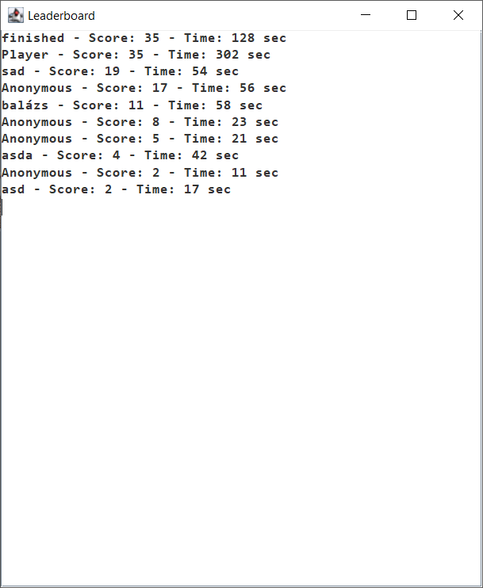

# WildGuard

Java-based 2D survival game where the player collects baskets while avoiding patrolling rangers.

## Features

- Enemy patrol system
- Collision detection
- Lives and respawn mechanics
- Collectible system
- Dynamic level handling
- Score tracking

## Technologies

- Java
- Swing GUI
- Object-Oriented Programming
- Game Logic
- Database management

## Screenshots

### Gameplay

### Leaderboard Example

